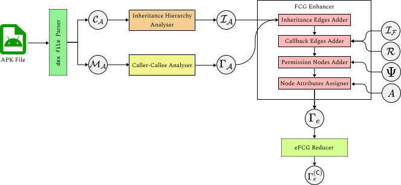

# AndMal-Detect

Android Malware Detection using Function Call Graphs and Graph Convolutional Networks

# What?

A research work carried out by me ([Vinayaka K V](https://github.com/vinayakakv)) during MTech (Research) degree in Department of IT, NITK.

The objectives of the research were:

1. To evaluate whether GCNs were effective in detecting Android Malware using FCGs, and which GCN algorithm is best for this task.
2. To enhance the FCGs by incorporating the callback information obtained from the framework code, and evaluate them against the normal FCGs

# Code organization

The code achieving first objective is present at `master`  branch, while the code achiving second objective is present at `experiment` (current) branch.

# Methodology

The architecture consists of two stages.

1. **Framework Space Analysis** - Analyses Android framework `framework.jar` to extract callback information and inheritance information from it.

2. **Application Space Analaysis** -  Analyzes the APK to extract FCG and derive "enhanced FCG" (eFCG) and "Reduced-eFCG" (R-eFCG).

## Datasets

Stored in the [`/data`](/data) folder. Currently, it contains SHA256 of the APKs containing in training and testing splits, which is balanced to ensure that the node-count distribution is same across benign and malware classes, to avoid any biases.

## Framework Space Analysis

Implemented in [`scripts/process_api.py`](scripts/process_api.py). Some important methods are:

- `get_argument_graph()`: Returns a mapping from classes to a list of methods, in which they are an argument of.

- `get_potential_api_callbacks()`: Returns the list of potential callbacks by filtering the API methods accroding to 4 conditions.

- `filter_potential_callbacks()`: Returns mapping from registration methods to the set of callback methods.

## Application Space Analysis

Implimented in [`scripts/process_dataset.py`](scripts/process_dataset.py).

The class `FeatureExtractors` provides two public methods:

1. `get_user_features()` - Returns 15-bit feature vector for *internal* methods
2. `get_api_features()` - Returns a one-hot feature vector for *external* methods

The class `APIConfig` loads the results of the Framework Space analysis.

The class `Heterograph` implements strongly typed heterogenous graph data structure with various sanity checks.

The method `process_apk` (155 line of code 🤯) extracts the FCG, converts it into eFCG and R-eFCG and assignes node features.

> Big thanks to [@vinyasns](https://github.com/vinyasns) for his insights while designing and implementing Framework Space Analysis and Application Space Analysis. Also, thanks to [@monishsr](https://github.com/monishsr) for helping me to choose suitable data format for graph serialization. 🙏🏽

## GCN Classifier

Multi-layer GCN with dense layer at the end.

Implemented in [`core/model.py`](core/model.py).

# The Execution Pipeline

1. Obtain the APKs using given SHA256 from [AndroZoo](https://androzoo.uni.lu/)
2. Obtain the `framework.jar` from an Android device (located at `/system/framework` in Android 11).
3. Build the container (either singularity or docker), and get into its shell
4. Run `scripts/process_api.py` with `framwork.jar` as argument
4. Run `scripts/process_dataset.py`[scripts/process_dataset.py] on the downloaded dataset

        python process_dataset.py \ 
            --source-dir <source_directory> \
            --dest-dir <dest_directory>
            --override # If you want to oveeride existing processed files \
            --dry # If you want to perform a dry run

4. Train the model! For configuration, refer to the section below.

       python train_model.py

# Configuration

The configuration is achieved using [Hydra](https://hydra.cc/). Look into [`config/conf.yaml`](config/conf.yaml) for available configuration options.

Any configuration option can be overridden in the command line. As an example, to change the number of convolution layers to 2, invoke the program as

    python train_model.py model.convolution_count=2

You can also perform a sweep, for example,

    python train_model.py \
            model.convolution_count=0,1,2,3 \
            node_configuration=core, code, all \
            data.data_type=fcg, rfcg

to train the model in all possible configurations! 🥳

# Extras

I also implemented a portion of the [PGMExplainer](https://arxiv.org/abs/2010.05788) for generating explanations for the classification outputs by the GCN classifier. Its source code is located at [`analysis/explainer.py`](analysis/explainer.py).

> Big thanks to [@ikshudhanva](https://github.com/ikshudhanva) for his suggestions while building the explainer module!

# Stack

- [`androguard`](https://androguard.readthedocs.io/en/lates) - For FCG extraction and Feature assignment
- [`pytorch`](https://pytorch.org/) - for Neural networks
- [`dgl`](https://www.dgl.ai/) - for GCN modules
- [`pytorch-lightning`](https://github.com/PyTorchLightning/pytorch-lightning) - for organization and pipeline 💖
- [`hydra`](https://hydra.cc/) - for configuring experiments
- [`wandb`](https://wandb.ai/) - for tracking experiments 🔥

# Research Outcomes

The outcomes of this research were communicatd to IEEE Access and got accepted (_Access-2021-22139_). However, due to the lack of support and funding, it was not published. Feel free to read the paper in [TechRxiv](https://doi.org/10.36227/techrxiv.15072087.v1)

## Cite as
        @misc{Vinayaka2021,
                title={Heterogeneous Graph Convolutional Networks for Android Malware Detection using Callback-Aware Caller-Callee Graphs},
                url={https://www.techrxiv.org/articles/preprint/Heterogeneous_Graph_Convolutional_Networks_for_Android_Malware_Detection_using_Callback-Aware_Caller-Callee_Graphs/15072087/1},
                DOI={10.36227/techrxiv.15072087.v1},
                publisher={TechRxiv}, 
                author={K V, Vinayaka and C D, Jaidhar}, 
                year={2021}, 
                month={Aug}
         } 
